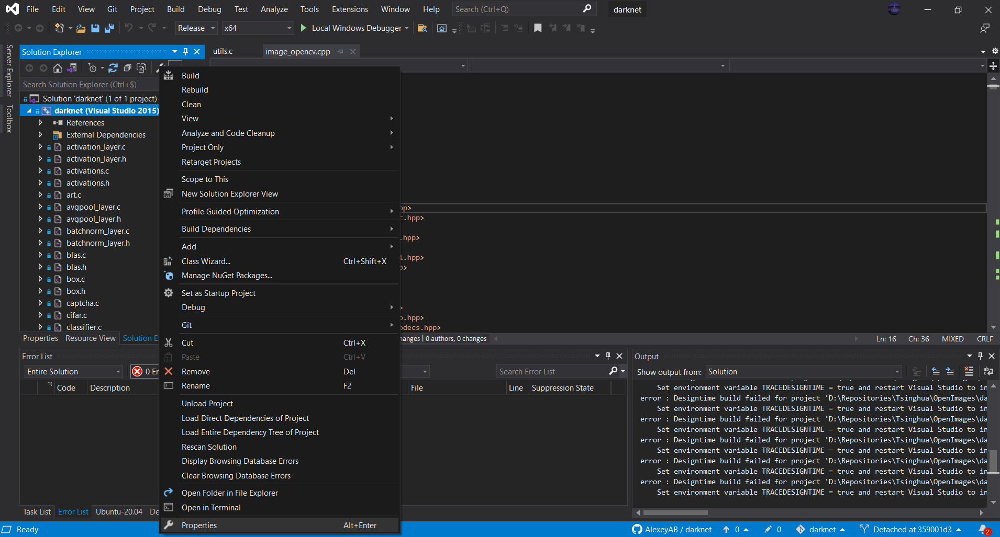
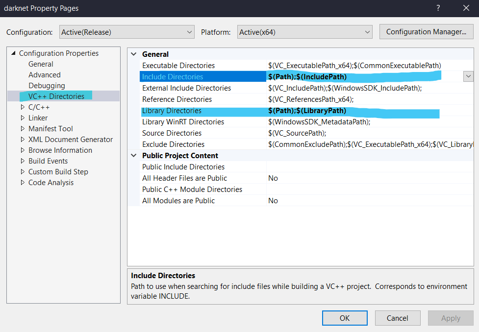
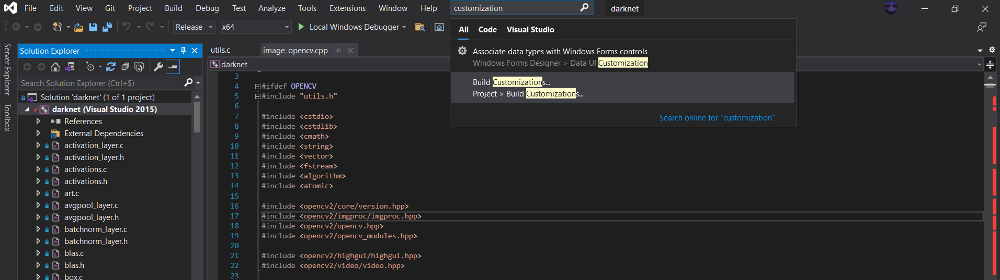
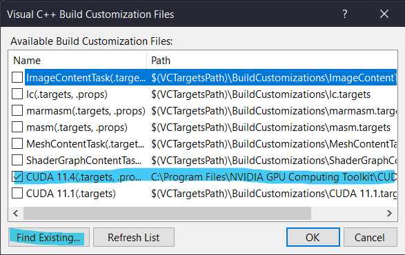
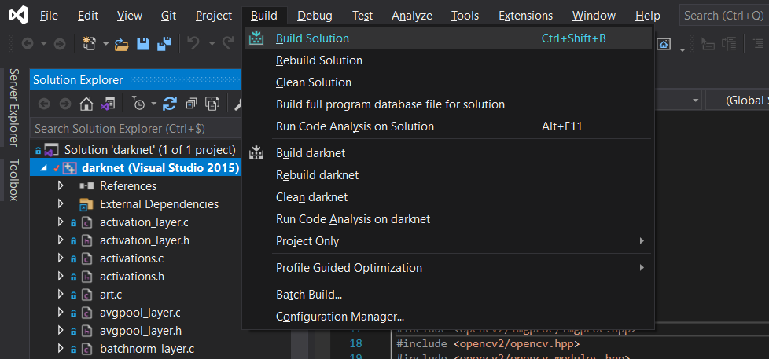
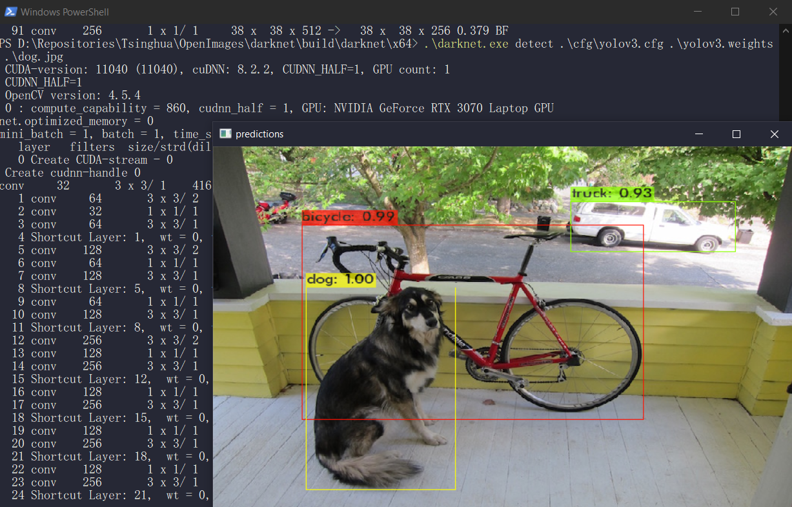
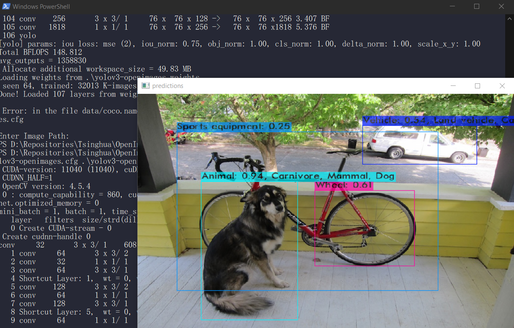

# YoloV3 - DarkNet

<p align="center">
  <br/><br/>
</p>


## Installation (on Windows)

### How to add a path to the $PATH environment variable

Check this tutorial first if you don't know how to add new codes to the global path 😄

https://docs.microsoft.com/en-us/previous-versions/office/developer/sharepoint-2010/ee537574(v=office.14)

### CUDA

Go on this link and install it with the given executable.

https://developer.nvidia.com/cuda-10.0-download-archive

> :warning: **Make sure to select an appropriate installation folder, we'll add it to the $PATH environment variable.**

Paths to add:

```
...\NVIDIA GPU Computing Toolkit\CUDA\v11.4\bin
```

```
...\NVIDIA GPU Computing Toolkit\CUDA\v11.4\libnvvp
```

### OpenCV

Go on this link and install it with the given executable.

https://sourceforge.net/projects/opencvlibrary/files/opencv-win/3.3.0/

> :warning: **Make sure to select an appropriate installation folder, we'll add it to the $PATH environment variable.**

Paths to add:

```
...\OpenCV\build\include
```

```
...\OpenCV\build\x64\vc14\lib
```

### CUDNN

https://developer.nvidia.com/rdp/cudnn-archive

### DarkNet

Pull the `darknet` submodule of this project by launching this command (at the root of the project):
```
git submodule update --init darknet
```

Then open the Visaul Studio Solution in `.\darknet\build\darknet\darknet.sln`.

From now on, you'll have to build `darknet`.

But to do so, you might need some corrections, but do try to build `darknet` directly, if everything is ok, then go on and try to use it.

#### Using OpenCV, CUDA & CUDNN

If Visual Studio has not already linked the environment varaibles to your `darkent` project, then follow these simple steps:

#### Step 1

Go in the Project's properties.

<br/><br/>

#### Step 2

Go in `Configuration Properties` -> `VC++ Directories` and modify `Include Directories` and `Library Directories` to add `$(Path)`. You can add it with the help of macros.

<br/><br/>

#### Step 3

Then, go in `Build Customizations`.

<br/><br/>

#### Step 4

And add your version of CUDA by clicking on `Find Existing...` and then by checking it.

<br/><br/>

#### Step 5

Then you can finally build `darknet` without any errors ! 🥳

<br/><br/>

## How to use DarkNet with YoloV3

You'll just have to use this command to launch the object detection on an image:

```
.\darknet.exe detect $CFG_FILE $WEIGHTS_FILE $IMAGE
```

<br/><br/>


## Our configuration

As we are using the OpenImages dataset, the results are quite different.

We are using the files contained in `./PreTrained_Config`.

To use our configuration for the OpenImages project, just launch this command:

```
darknet detector test .\PreTrained_Config\openimages.data .\PreTrained_Config\yolov3-openimage.cfg .\PreTrained_Config\yolov3-openimages.weights $IMAGE
```

<br/><br/>

